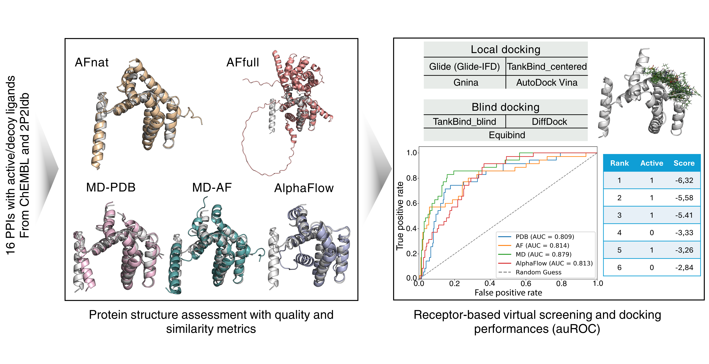

# Advances in Docking Protocols for PPIs: Insights from AlphaFold2 and Molecular Dynamics Refinement

## Introduction

Protein-protein interaction (PPI) modulation has seen significant advancements due to improvements in docking protocols. This study investigates the performance of AlphaFold2 (AF2) models in comparison to experimentally solved structures when used in docking protocols targeting PPIs. By evaluating a dataset of 16 interactions with validated modulators, we benchmarked eight docking protocols, finding that native and AF2 models perform similarly. Notably, local docking strategies, particularly TankBind_local and Glide, provided superior results across various structural types.

Molecular dynamics (MD) simulations and ensemble generation algorithms like AlphaFlow were used to refine native and AF2 models, which improved docking outcomes but also revealed significant variability across different conformations. Our findings indicate that the effectiveness of docking protocols is more influenced by scoring functions than by the initial quality of protein models. While protein ensembles can enhance virtual screening, identifying the most effective conformations for docking remains a challenge. This study underscores the potential of AF2 in PPI docking and highlights the need for further refinement in scoring methodologies.

## Datasets

The input and output datasets used in this study are publicly available and can be downloaded from Zenodo. Please follow the instructions below to access the data:

1. Visit the Zenodo repository for this project: [Zenodo Dataset Link](https://zenodo.org/records/13757872)
2. Download the dataset input/output files (28,3 GB compressed file and ~75GB uncompressed), which include:
   - **Input protein and ligand structures**: Prepared protein and ligand files
   - **AlphaFlow input files**: Input CSV and MSAs
   - **Figure datasets**: Datasets to reproduce the figures used in the paper
   - **Docking outputs**: Output files generated by docking tools
   - **MD outputs**: MD output files
   - **ROC/auROC results**: Docking output files containing scores and auROC values
   
After downloading, extract the files into the `data/` directory of this repository.

## Third-Party Tools Overview

This study utilized a variety of third-party tools, including protein scoring systems, generative models like AlphaFlow for emulating MD ensembles, and multiple docking tools. To ensure proper functionality, please install the necessary dependencies for each tool. Detailed documentation can be found on their respective pages.

### Docking Tools

Ligands and proteins were prepared using Schrödinger Maestro's LigPrep and Protein Preparation protocols, respectively. The prepared ligand (SD files) and protein (PDB) files are available in `data/input_files/Protein_structures`. Key steps include:

- **Ligand Preparation:** 3D conformations were generated using the OPLS4 force field, with ligands saved as SD files. Ligands containing more than 500 atoms were excluded.
- **Protein Preparation:** Proteins underwent preprocessing and optimization, including the addition of hydrogens, disulfide bonds, and missing side chains with Prime. Het states were generated using Epik, followed by energy minimization with the OPLS4 force field.

The processed protein and ligand files were converted to PDBQT format using [Open Babel 3.1.0](https://github.com/openbabel/openbabel/releases/tag/openbabel-3-1-0) as required by AutoDock Vina. Docking was conducted on individual protein chains, focusing on the protein complex interface. The grid center coordinates and simulation box sizes can be found in `data/input_files/interface_center.txt`, obtained using the script `scripts/protein_analysis/interface_center.py`.

#### Docking Tools Used:

- **Glide and Glide-IFD:** The only commercial software used in this study. Glide version 2021-2 was employed.
- **AutoDock Vina:** [Download pre-built binary AutoDock Vina 1.2.5](https://github.com/ccsb-scripps/AutoDock-Vina/releases/tag/v1.2.5).
- **Gnina:** [Download pre-built binary Gnina 1.0](https://github.com/gnina/gnina/releases/tag/v1.0).
- **EquiBind:** Set up the conda environment as per the guide [here](https://github.com/HannesStark/EquiBind).
- **DiffDock:** Set up the conda environment as per the guide [here](https://github.com/gcorso/DiffDock).
- **TankBind:** Set up the conda environment as per the guide [here](https://github.com/luwei0917/TankBind). Additionally, download p2rank v2.3 from [this link](https://github.com/rdk/p2rank/releases/download/2.3/p2rank_2.3.tar.gz).

### AlphaFlow

To install AlphaFlow, follow the instructions [here](https://github.com/bjing2016/alphaflow). The AlphaFlow-MD model weights were utilized in this study. For clustering AlphaFlow ensembles and selecting representative structures, MaxCluster was used, which can be downloaded from [here](http://www.sbg.bio.ic.ac.uk/~maxcluster/#Download).

### Protein Scoring

Protein quality was assessed using the following tools:

- **DockQ:** Install via pip from [this repository](https://github.com/bjornwallner/DockQ).
- **pDockQ2:** Available [here](https://gitlab.com/ElofssonLab/afm-benchmark) at `src/pdockq2.py`.
- **MM-Align:** Install executable from [here](https://zhanggroup.org/MM-align/). 

## Scripts

To reproduce the results or use the docking tools, follow these steps:

1. **Install Dependencies**: Ensure all required third-party tools and dependencies are installed. See the [Third-Party Tools Overview](#third-party-tools-overview) section for detailed instructions.
2. **Download datasets**: Download all necessary files from Zenodo: [Zenodo Dataset Link](https://zenodo.org/records/13757872) 
3. **Run Scripts**: Execute the scripts provided in `scripts/` to run the docking protocols, protein analysis, MD analysis, reproducing figures... More details can be found in `scripts/`.

## Citation

If you use this repository in your research, please cite the following paper:

